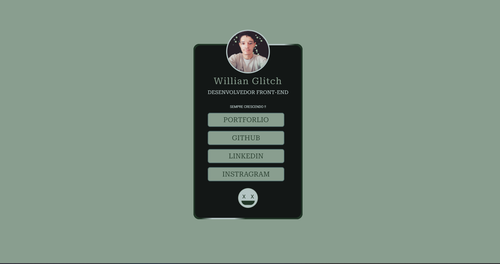

<h1 align="center"> LINK-TREE  </h1>

Design e projeto exclusivo para facilitar a localização de redes sociais.

  <a href="#-tecnologias">Tecnologias</a>&nbsp;&nbsp;&nbsp;|&nbsp;&nbsp;&nbsp;
  <a href="#-projeto">Projeto</a>&nbsp;&nbsp;&nbsp;|&nbsp;&nbsp;&nbsp;
  <a href="#-layout">Layout</a>&nbsp;&nbsp;&nbsp;|&nbsp;&nbsp;&nbsp;
  <a href="#memo-licença">Licença</a>

  

 

  

 

## 🚀 Tecnologias

Esse projeto foi desenvolvido com as seguintes tecnologias:

- HTML
- CSS
- Git e GitHub
- Figma

 

## 💻 Projeto

O LINK-TREE é uma aplicação que procurar facilitar a entrada em outras redes sociáis do usuario.

[🔗 Acesse aqui](https://willianglitch.xyz/)

 

## 🔖 Layout

Você pode visualizar o layout do projeto através [desse link](<https://www.figma.com/file/dGAOZy7uBAMkF3R7zz5l13/Link-Tree?node-id=0%3A1&t=rv88akF76sylYfzF-1>). É necessário ter conta no [Figma](https://figma.com) para acessá-lo.

 

## :memo: Licença

Esse projeto está sob a licença MIT.

---

Feito by willianglitch :wave: [LinkedIn](https://www.linkedin.com/in/willianglitchprogramador/)